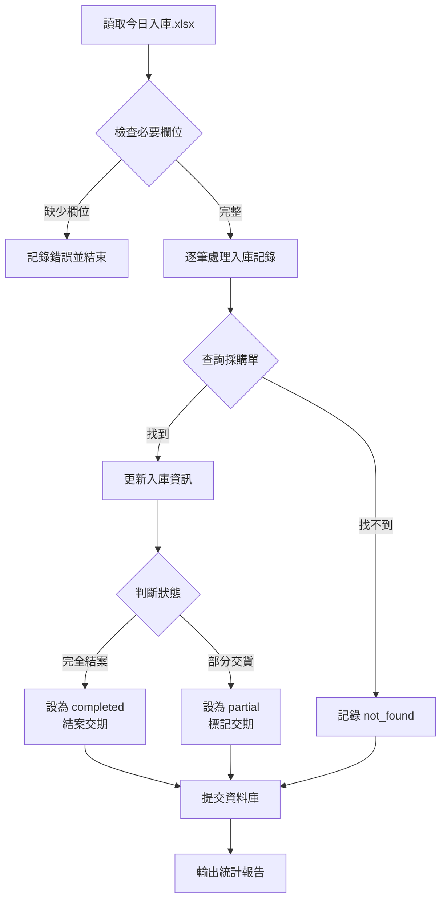
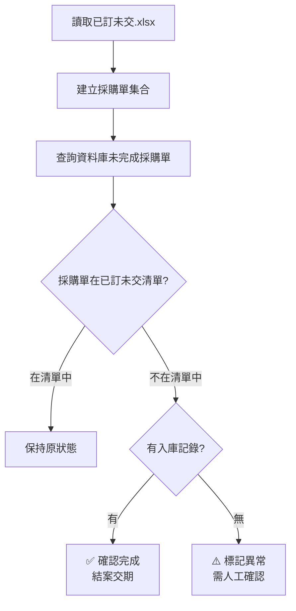

# 今日入庫零件功能分析報告

## 📋 功能概述

**功能名稱**：入庫記錄同步服務 (Receipt Sync Service)  
**主要檔案**：[`tools/sync_receipt_records.py`](file:///c:/app/order/tools/sync_receipt_records.py)  
**測試工具**：[`tools/test_receipt_sync.py`](file:///c:/app/order/tools/test_receipt_sync.py)  
**資料來源**：`P:\F004\MPS維護\今日入庫.xlsx`

---

## 🎯 核心功能邏輯

### 1. 入庫記錄同步 (`sync_receipts`)

**處理流程**：


**必要欄位**：
- `採購單` - 採購文件編號
- `項目` - 採購項目編號
- `物料` - 物料編號
- `以輸入單位表示的數量` - 入庫數量
- `過帳日期` - 入庫日期

**採購單號格式**：`{採購單}-{項目}` (例如：`4500123456-10`)

---

### 2. 入庫資訊更新邏輯

#### 數量計算
```python
新收貨數量 = 原收貨數量 + 本次入庫數量
未交數量 = 訂購數量 - 新收貨數量
```

#### 狀態判定

| 條件 | 狀態 | 動作 |
|------|------|------|
| 未交數量 ≤ 0.01 | `completed` | ✅ 完全結案<br/>🔒 自動結案交期<br/>📝 記錄實際交期 |
| 收貨數量 > 0 且未完成 | `partial` | 📦 部分交貨<br/>📝 標記交期需更新<br/>🔔 記錄部分交貨資訊 |
| 其他 | `updated` | 僅更新數量 |

---

### 3. 交期管理功能

#### 完全結案交期
**檔案**：`instance/delivery_schedules.json`  
**動作**：移除與該採購單相關的所有交期記錄

#### 部分交貨標記
**更新內容**：
- `status`: `partial_received`
- `partial_note`: 已部分到貨 X 件，剩餘 Y 件待交
- `partial_date`: 標記時間
- `needs_update`: `true` (標記需要人工確認)

---

### 4. 交叉比對功能 (`cross_validate_with_on_order`)

**目的**：確認採購單消失是否真的已入庫

**邏輯**：


**異常情況**：
- 採購單不在「已訂未交」清單
- 資料庫中狀態為 `pending` 或 `partial`
- 沒有 `actual_delivery_date` 記錄

---

## 📊 統計輸出

執行後會輸出以下統計資訊：

```
==========================================================
入庫同步統計：
  處理記錄數：XXX
  成功更新：XXX
  完全結案：XXX
  部分交貨：XXX
  找不到採購單：XXX
  錯誤數：XXX
==========================================================
```

---

## 🚀 執行方式

### ⚠️ **目前狀態：手動執行模式**

> **重要發現**：此功能目前**沒有自動排程**，需要手動執行。

### 執行指令

#### 1. 測試模式（推薦先執行）
```bash
python tools/test_receipt_sync.py
```

**測試內容**：
- ✅ 檔案讀取測試
- ✅ 資料庫連線測試
- ✅ 模擬執行（不寫入資料庫）
- ✅ 統計分析與 CSV 匯出

**匯出檔案**：
- `入庫記錄_找不到採購單.csv`
- `入庫記錄_將完全結案.csv`
- `入庫記錄_部分交貨.csv`

#### 2. 正式同步
```bash
# 僅同步入庫記錄
python tools/sync_receipt_records.py

# 同步 + 交叉比對
python tools/sync_receipt_records.py --cross-validate

# 自訂檔案路徑
python tools/sync_receipt_records.py --receipt-file "路徑/今日入庫.xlsx"
```

---

## ⏰ 建議排程時間

### 方案 A：每日自動執行（推薦）

**建議時間**：
- **上午 8:00** - 處理前一日入庫記錄
- **下午 14:00** - 處理當日上午入庫記錄
- **下午 17:00** - 處理當日下午入庫記錄

**實作方式**：
1. 使用 Windows 工作排程器
2. 或整合到 Flask 應用程式中使用 APScheduler

### 方案 B：手動執行

**適用情境**：
- 需要人工確認後再執行
- 入庫記錄不規律
- 需要先測試再正式同步

---

## 🔧 技術細節

### 資料庫模型
**使用模型**：`PurchaseOrder`

**關鍵欄位**：
- `po_number` - 採購單號（主鍵）
- `material_id` - 物料編號
- `ordered_quantity` - 訂購數量
- `received_quantity` - 已收貨數量
- `outstanding_quantity` - 未交數量
- `actual_delivery_date` - 實際交期
- `status` - 狀態 (`pending`, `partial`, `completed`)

### 批次處理
- 每處理 **100 筆**提交一次資料庫
- 避免大量資料一次性提交造成鎖定

### 錯誤處理
- 逐筆處理，單筆錯誤不影響其他記錄
- 詳細的日誌記錄（INFO, WARNING, ERROR）
- 異常情況會記錄但不中斷執行

---

## 📁 相關檔案路徑

| 類型 | 路徑 | 說明 |
|------|------|------|
| **資料來源** | `P:\F004\MPS維護\今日入庫.xlsx` | 今日入庫記錄 |
| **比對檔案** | `P:\F004\MPS維護\已訂未交.XLSX` | 已訂未交清單 |
| **交期檔案** | `instance/delivery_schedules.json` | 交期排程資料 |
| **主程式** | [`tools/sync_receipt_records.py`](file:///c:/app/order/tools/sync_receipt_records.py) | 同步服務 |
| **測試工具** | [`tools/test_receipt_sync.py`](file:///c:/app/order/tools/test_receipt_sync.py) | 測試與分析 |
| **配置檔** | [`app/config/paths.py`](file:///c:/app/order/app/config/paths.py) | 路徑設定 |

---

## 💡 使用建議

### 首次使用流程

1. **執行測試**
   ```bash
   python tools/test_receipt_sync.py
   ```
   - 確認檔案可讀取
   - 檢視統計分析
   - 匯出 CSV 檢查

2. **檢視測試結果**
   - 查看「找不到採購單」清單
   - 確認「將完全結案」是否合理
   - 檢查「部分交貨」數量

3. **正式執行**
   ```bash
   python tools/sync_receipt_records.py --cross-validate
   ```

4. **驗證結果**
   - 檢查日誌輸出
   - 確認統計數字
   - 查詢資料庫驗證

### 日常使用建議

- ✅ 定期執行（建議每日 1-2 次）
- ✅ 先測試再正式同步
- ✅ 保留測試匯出的 CSV 作為記錄
- ✅ 監控「找不到採購單」數量
- ✅ 定期執行交叉比對

---

## ⚠️ 注意事項

1. **資料完整性**
   - 確保「今日入庫.xlsx」包含所有必要欄位
   - 採購單號格式必須一致

2. **執行時機**
   - 避免在系統高峰時段執行
   - 建議在資料更新後執行

3. **異常處理**
   - 「找不到採購單」可能原因：
     - 採購單尚未匯入系統
     - 採購單號格式不一致
     - 已被刪除的舊採購單

4. **交期管理**
   - 完全結案會自動移除交期
   - 部分交貨會標記需要更新
   - 建議定期檢查 `delivery_schedules.json`

---

## 🎯 總結

| 項目 | 狀態 |
|------|------|
| **功能完整性** | ✅ 完整實作 |
| **測試工具** | ✅ 提供完整測試 |
| **錯誤處理** | ✅ 健全的錯誤處理 |
| **日誌記錄** | ✅ 詳細的日誌 |
| **自動排程** | ❌ **未實作（需手動執行）** |
| **文件說明** | ✅ 完整的 help 訊息 |

**建議下一步**：
1. 先執行測試工具熟悉功能
2. 決定是否需要自動排程
3. 如需自動排程，可整合 APScheduler 或 Windows 工作排程器
