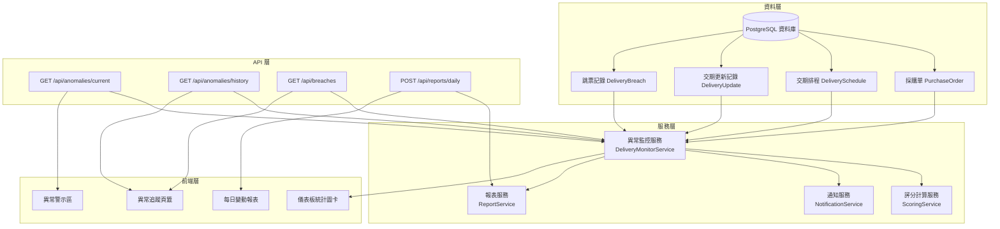
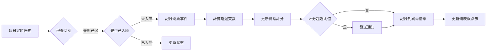

# 採購儀表板智慧化管理功能規劃

## 文件版本資訊
- **版本**: 1.0.0
- **建立日期**: 2026-05-03
- **最後更新**: 2026-05-03
- **作者**: 系統架構規劃

---

## 一、需求分析

### 1.1 問題描述
目前採購儀表板需要人工仔細檢視才能發現異常項目，特別是：
- 交貨延期項目（交期已過但未入庫）
- 需求預期項目（即將到期但尚未採購）
- 物料交期到期未入庫、持續跳票的項目
- 每日數據變動難以即時掌握

### 1.2 目標
建立智慧化的異常監控系統，讓主管和採購承辦人員能：
1. **即時掌握**關鍵管理指標
2. **自動識別**異常項目（跳票、延期、缺料）
3. **追蹤歷史**變動記錄
4. **優先處理**高風險項目

---

## 二、系統架構設計

### 2.1 整體架構圖



### 2.2 資料流程圖



---

## 三、資料庫模型擴充

### 3.1 新增：跳票記錄表 (DeliveryBreach)

```python
# app/models/database.py

class DeliveryBreach(db.Model):
    """交期跳票記錄"""
    __tablename__ = 'delivery_breaches'
    
    id = db.Column(db.Integer, primary_key=True)
    material_id = db.Column(db.String(50), db.ForeignKey('materials.material_id'), nullable=False, index=True)
    po_number = db.Column(db.String(50), db.ForeignKey('purchase_orders.po_number'), nullable=True, index=True)
    schedule_id = db.Column(db.Integer, db.ForeignKey('delivery_schedules.id'), nullable=True, index=True)
    
    # 跳票資訊
    expected_date = db.Column(db.Date, nullable=False)  # 原預計交期
    breach_date = db.Column(db.Date, nullable=False)    # 跳票發生日期（交期過期日）
    resolved_date = db.Column(db.Date, nullable=True)   # 解決日期（實際入庫日）
    breach_days = db.Column(db.Integer, default=0)      # 跳票天數
    breach_reason = db.Column(db.String(200))           # 跳票原因（可選填）
    
    # 狀態
    status = db.Column(db.String(20), default='active')  # active, resolved, cancelled
    
    # 關聯
    material = db.relationship('Material', back_populates='breaches')
    purchase_order = db.relationship('PurchaseOrder', back_populates='breaches')
    delivery_schedule = db.relationship('DeliverySchedule', back_populates='breaches')
    
    # 系統欄位
    created_at = db.Column(db.DateTime, default=get_taiwan_time)
    updated_at = db.Column(db.DateTime, default=get_taiwan_time, onupdate=get_taiwan_time)
    
    def __repr__(self):
        return f'<DeliveryBreach {self.material_id} - {self.expected_date}>'
```

### 3.2 擴充：採購單模型 (PurchaseOrder)

```python
# 在 PurchaseOrder 模型中新增關聯
class PurchaseOrder(db.Model):
    # ... 現有欄位 ...
    
    # 新增關聯
    breaches = db.relationship('DeliveryBreach', back_populates='purchase_order', cascade='all, delete-orphan')
    
    # 新增計算欄位（不儲存，動態計算）
    @property
    def total_breach_count(self):
        """總跳票次數"""
        from sqlalchemy import func
        return db.session.query(func.count(DeliveryBreach.id)).filter(
            DeliveryBreach.po_number == self.po_number
        ).scalar()
    
    @property
    def max_breach_days(self):
        """最大跳票天數"""
        breach = db.session.query(DeliveryBreach).filter(
            DeliveryBreach.po_number == self.po_number
        ).order_by(DeliveryBreach.breach_days.desc()).first()
        return breach.breach_days if breach else 0
```

### 3.3 擴充：交期排程模型 (DeliverySchedule)

```python
# 在 DeliverySchedule 模型中新增關聯
class DeliverySchedule(db.Model):
    # ... 現有欄位 ...
    
    # 新增關聯
    breaches = db.relationship('DeliveryBreach', back_populates='delivery_schedule', cascade='all, delete-orphan')
    
    # 新增計算欄位
    @property
    def is_overdue(self):
        """是否已過期"""
        from datetime import date
        return self.expected_date < date.today() and self.status not in ['completed', 'cancelled']
    
    @property
    def overdue_days(self):
        """過期天數"""
        from datetime import date
        if self.is_overdue:
            return (date.today() - self.expected_date).days
        return 0
```

### 3.4 擴充：物料模型 (Material)

```python
# 在 Material 模型中新增關聯
class Material(db.Model):
    # ... 現有欄位 ...
    
    # 新增關聯
    breaches = db.relationship('DeliveryBreach', back_populates='material', cascade='all, delete-orphan')
    
    # 新增計算欄位
    @property
    def active_breach_count(self):
        """當前未解決的跳票次數"""
        from sqlalchemy import func
        return db.session.query(func.count(DeliveryBreach.id)).filter(
            DeliveryBreach.material_id == self.material_id,
            DeliveryBreach.status == 'active'
        ).scalar()
```

---

## 四、異常評分演算法設計

### 4.1 評分模型

```python
# app/services/scoring_service.py

class AnomalyScoringService:
    """異常評分服務"""
    
    # 評分權重配置
    WEIGHTS = {
        'delay_days': 0.35,        # 延遲天數權重
        'shortage_quantity': 0.25, # 缺料數量權重
        'production_impact': 0.25, # 生產影響權重
        'breach_history': 0.15     # 跳票歷史權重
    }
    
    @classmethod
    def calculate_anomaly_score(cls, material_data, delivery_data, demand_data):
        """
        計算物料異常評分（0-100 分，分數越高越緊急）
        
        參數:
            material_data: 物料基本資料
            delivery_data: 交期資料（包含 delivery_schedules）
            demand_data: 需求資料（包含 demand_details）
        
        回傳:
            score: 0-100 的評分
            breakdown: 各維度得分明細
        """
        breakdown = {}
        
        # 1. 延遲天數評分 (0-100)
        delay_score = cls._calculate_delay_score(delivery_data)
        breakdown['delay_days'] = delay_score
        
        # 2. 缺料數量評分 (0-100)
        shortage_score = cls._calculate_shortage_score(material_data)
        breakdown['shortage_quantity'] = shortage_score
        
        # 3. 生產影響評分 (0-100)
        production_score = cls._calculate_production_impact(demand_data)
        breakdown['production_impact'] = production_score
        
        # 4. 跳票歷史評分 (0-100)
        history_score = cls._calculate_breach_history_score(material_data)
        breakdown['breach_history'] = history_score
        
        # 加權總分
        total_score = (
            delay_score * cls.WEIGHTS['delay_days'] +
            shortage_score * cls.WEIGHTS['shortage_quantity'] +
            production_score * cls.WEIGHTS['production_impact'] +
            history_score * cls.WEIGHTS['breach_history']
        )
        
        return {
            'score': round(total_score, 2),
            'breakdown': breakdown,
            'priority': cls._get_priority_level(total_score)
        }
    
    @classmethod
    def _calculate_delay_score(cls, delivery_data):
        """計算延遲天數評分"""
        if not delivery_data or not delivery_data.get('delivery_schedules'):
            return 0
        
        max_delay = 0
        for schedule in delivery_data['delivery_schedules']:
            if schedule.get('status') == 'overdue':
                delay_days = schedule.get('overdue_days', 0)
                max_delay = max(max_delay, delay_days)
        
        # 評分：0 天=0 分，30 天以上=100 分
        score = min(100, (max_delay / 30) * 100)
        return round(score, 2)
    
    @classmethod
    def _calculate_shortage_score(cls, material_data):
        """計算缺料數量評分"""
        current_shortage = abs(material_data.get('current_shortage', 0))
        projected_shortage = abs(material_data.get('projected_shortage', 0))
        total_shortage = current_shortage + projected_shortage
        
        if total_shortage == 0:
            return 0
        
        # 評分：根據缺料數量級別
        if total_shortage >= 10000:
            return 100
        elif total_shortage >= 1000:
            return 80
        elif total_shortage >= 100:
            return 60
        elif total_shortage >= 10:
            return 40
        else:
            return 20
    
    @classmethod
    def _calculate_production_impact(cls, demand_data):
        """計算生產影響評分"""
        if not demand_data or not demand_data.get('demand_details'):
            return 0
        
        # 檢查是否有已過期的需求
        from datetime import date, timedelta
        today = date.today()
        critical_count = 0
        total_count = len(demand_data['demand_details'])
        
        for demand in demand_data['demand_details']:
            demand_date = demand.get('需求日期')
            if demand_date and demand_date < today:
                critical_count += 1
            elif demand_date and demand_date < today + timedelta(days=7):
                critical_count += 0.5
        
        if total_count == 0:
            return 0
        
        score = (critical_count / total_count) * 100
        return min(100, round(score, 2))
    
    @classmethod
    def _calculate_breach_history_score(cls, material_data):
        """計算跳票歷史評分"""
        breach_count = material_data.get('active_breach_count', 0)
        
        if breach_count == 0:
            return 0
        
        # 評分：跳票次數越多分數越高
        if breach_count >= 5:
            return 100
        elif breach_count >= 3:
            return 80
        elif breach_count >= 2:
            return 60
        else:
            return 40
    
    @classmethod
    def _get_priority_level(cls, score):
        """根據評分獲取優先級"""
        if score >= 80:
            return 'critical'  # 極高優先級
        elif score >= 60:
            return 'high'      # 高優先級
        elif score >= 40:
            return 'medium'    # 中優先級
        elif score >= 20:
            return 'low'       # 低優先級
        else:
            return 'normal'    # 正常
```

### 4.2 優先級定義

| 優先級 | 評分範圍 | 顏色標記 | 處理建議 |
|--------|----------|----------|----------|
| Critical (極高) | 80-100 | 紅色 | 立即處理，主管介入 |
| High (高) | 60-79 | 橘色 | 24 小時內處理 |
| Medium (中) | 40-59 | 黃色 | 3 日內處理 |
| Low (低) | 20-39 | 淺黃色 | 一週內處理 |
| Normal (正常) | 0-19 | 綠色 | 常規追蹤 |

---

## 五、異常警示區 UI 設計

### 5.1 組件結構

```html
<!-- 異常警示區組件 -->
<div id="anomaly-alert-section" class="anomaly-alert-section" style="display: none;">
    <div class="alert-header">
        <h3>⚠️ 異常警示</h3>
        <button class="dismiss-btn" onclick="dismissAnomalyAlert()">✖</button>
    </div>
    
    <div class="alert-summary">
        <div class="alert-stat">
            <span class="stat-icon">🔴</span>
            <span class="stat-value" id="critical-count">0</span>
            <span class="stat-label">極高優先級</span>
        </div>
        <div class="alert-stat">
            <span class="stat-icon">🟠</span>
            <span class="stat-value" id="high-count">0</span>
            <span class="stat-label">高優先級</span>
        </div>
        <div class="alert-stat">
            <span class="stat-icon">🟡</span>
            <span class="stat-value" id="medium-count">0</span>
            <span class="stat-label">中優先級</span>
        </div>
    </div>
    
    <div class="alert-list">
        <!-- 動態載入異常項目清單 -->
        <div class="alert-item critical" data-score="95">
            <div class="item-header">
                <span class="priority-badge critical">CRITICAL</span>
                <span class="item-material">MAT-001234</span>
                <span class="item-score">95 分</span>
            </div>
            <div class="item-details">
                <span>延遲 15 天</span>
                <span>缺料 5000 件</span>
                <span>跳票 3 次</span>
            </div>
        </div>
    </div>
    
    <div class="alert-footer">
        <button onclick="viewAllAnomalies()">查看全部異常 →</button>
    </div>
</div>
```

### 5.2 CSS 樣式

```css
/* app/static/css/components/anomaly-alert.css */

.anomaly-alert-section {
    position: fixed;
    top: 80px;
    right: 20px;
    width: 350px;
    max-height: 500px;
    overflow-y: auto;
    background: var(--color-warning-bg);
    border: 2px solid var(--color-warning);
    border-radius: 8px;
    box-shadow: 0 4px 12px rgba(0, 0, 0, 0.3);
    z-index: 1000;
}

.alert-header {
    display: flex;
    justify-content: space-between;
    align-items: center;
    padding: 10px 15px;
    background: var(--color-warning);
    color: white;
    border-top-left-radius: 6px;
    border-top-right-radius: 6px;
}

.alert-summary {
    display: flex;
    justify-content: space-around;
    padding: 15px;
    border-bottom: 1px solid var(--pico-border-color);
}

.alert-stat {
    display: flex;
    flex-direction: column;
    align-items: center;
}

.stat-value {
    font-size: 1.5em;
    font-weight: bold;
    margin: 5px 0;
}

.alert-list {
    padding: 10px;
}

.alert-item {
    padding: 10px;
    margin-bottom: 8px;
    border-radius: 4px;
    cursor: pointer;
    transition: all 0.2s;
}

.alert-item:hover {
    transform: translateX(5px);
}

.alert-item.critical {
    background: rgba(244, 67, 54, 0.15);
    border-left: 4px solid #f44336;
}

.alert-item.high {
    background: rgba(255, 152, 0, 0.15);
    border-left: 4px solid #ff9800;
}

.alert-item.medium {
    background: rgba(255, 235, 59, 0.15);
    border-left: 4px solid #ffeb3b;
}

.priority-badge {
    padding: 2px 8px;
    border-radius: 4px;
    font-size: 0.75em;
    font-weight: bold;
}

.priority-badge.critical {
    background: #f44336;
    color: white;
}

.priority-badge.high {
    background: #ff9800;
    color: white;
}

.priority-badge.medium {
    background: #ffeb3b;
    color: black;
}
```

---

## 六、異常追蹤頁籤設計

### 6.1 頁面結構

```html
<!-- 在採購儀表板頁籤中新增「異常追蹤」頁籤 -->
<nav id="dashboard-tabs-nav">
    <ul>
        <li><a href="#" class="dashboard-tab-link" data-tab="tab-main-dashboard">半品儀表板</a></li>
        <li><a href="#" class="dashboard-tab-link" data-tab="tab-finished-dashboard">成品儀表板</a></li>
        <li><a href="#" class="dashboard-tab-link" data-tab="tab-anomaly-tracking">異常追蹤 🔔</a></li>
    </ul>
</nav>

<div id="dashboard-tabs-content">
    <!-- 現有頁籤內容 -->
    
    <!-- 新增：異常追蹤頁籤 -->
    <div id="tab-anomaly-tracking" class="dashboard-tab-content">
        <h3>異常追蹤儀表板</h3>
        
        <!-- 篩選控制 -->
        <div class="filter-controls">
            <select id="anomaly-priority-filter">
                <option value="all">所有優先級</option>
                <option value="critical">極高優先級</option>
                <option value="high">高優先級</option>
                <option value="medium">中優先級</option>
                <option value="low">低優先級</option>
            </select>
            
            <select id="anomaly-type-filter">
                <option value="all">所有類型</option>
                <option value="delayed">交期延遲</option>
                <option value="breach">交期跳票</option>
                <option value="shortage">嚴重缺料</option>
            </select>
            
            <button id="refresh-anomalies-btn">🔄 重新整理</button>
        </div>
        
        <!-- 異常清單表格 -->
        <table class="anomaly-table">
            <thead>
                <tr>
                    <th>優先級</th>
                    <th>物料編號</th>
                    <th>物料說明</th>
                    <th>異常評分</th>
                    <th>延遲天數</th>
                    <th>缺料數量</th>
                    <th>跳票次數</th>
                    <th>採購人員</th>
                    <th>操作</th>
                </tr>
            </thead>
            <tbody id="anomaly-table-body">
                <!-- 動態載入 -->
            </tbody>
        </table>
        
        <!-- 跳票歷史區 -->
        <details style="margin-top: 2em;">
            <summary>📜 跳票歷史記錄</summary>
            <div id="breach-history-section">
                <table class="breach-history-table">
                    <thead>
                        <tr>
                            <th>日期</th>
                            <th>物料編號</th>
                            <th>採購單號</th>
                            <th>原交期</th>
                            <th>跳票天數</th>
                            <th>狀態</th>
                        </tr>
                    </thead>
                    <tbody id="breach-history-body">
                        <!-- 動態載入 -->
                    </tbody>
                </table>
            </div>
        </details>
    </div>
</div>
```

---

## 七、每日變動報表設計

### 7.1 報表資料結構

```python
# app/services/report_service.py

class DailyChangeReportService:
    """每日變動報表服務"""
    
    @classmethod
    def generate_daily_report(cls, date=None):
        """
        生成每日變動報表
        
        參數:
            date: 報表日期（預設為今天）
        
        回傳:
            report_data: 報表資料結構
        """
        from datetime import date as date_type, timedelta
        from sqlalchemy import func, and_
        
        report_date = date or date_type.today()
        
        # 1. 當日新增跳票
        new_breaches = db.session.query(DeliveryBreach).filter(
            DeliveryBreach.breach_date == report_date,
            DeliveryBreach.status == 'active'
        ).all()
        
        # 2. 當日解決跳票
        resolved_breaches = db.session.query(DeliveryBreach).filter(
            DeliveryBreach.resolved_date == report_date
        ).all()
        
        # 3. 當日交期變更
        delivery_updates = db.session.query(DeliveryUpdate).filter(
            func.date(DeliveryUpdate.updated_at) == report_date
        ).all()
        
        # 4. 當日缺料狀態變化
        # （需要比對前一天的缺料狀態）
        shortage_changes = cls._detect_shortage_changes(report_date)
        
        return {
            'report_date': report_date.strftime('%Y-%m-%d'),
            'summary': {
                'new_breaches_count': len(new_breaches),
                'resolved_breaches_count': len(resolved_breaches),
                'delivery_updates_count': len(delivery_updates),
                'shortage_changes_count': len(shortage_changes)
            },
            'new_breaches': [cls._format_breach(b) for b in new_breaches],
            'resolved_breaches': [cls._format_breach(b) for b in resolved_breaches],
            'delivery_updates': [cls._format_update(u) for u in delivery_updates],
            'shortage_changes': shortage_changes
        }
    
    @classmethod
    def export_report_to_excel(cls, date=None):
        """匯出每日變動報表為 Excel"""
        from openpyxl import Workbook
        from io import BytesIO
        
        report_data = cls.generate_daily_report(date)
        
        wb = Workbook()
        
        # Sheet 1: 報表摘要
        summary_sheet = wb.active
        summary_sheet.title = '報表摘要'
        summary_sheet.append(['每日變動報表', f'{report_data["report_date"]}'])
        summary_sheet.append([])
        summary_sheet.append(['項目', '數量'])
        summary_sheet.append(['新增跳票', report_data['summary']['new_breaches_count']])
        summary_sheet.append(['解決跳票', report_data['summary']['resolved_breaches_count']])
        summary_sheet.append(['交期變更', report_data['summary']['delivery_updates_count']])
        summary_sheet.append(['缺料變化', report_data['summary']['shortage_changes_count']])
        
        # Sheet 2: 新增跳票明細
        new_breach_sheet = wb.create_sheet('新增跳票')
        new_breach_sheet.append(['物料編號', '物料說明', '採購單號', '原交期', '跳票天數', '採購人員'])
        for breach in report_data['new_breaches']:
            new_breach_sheet.append([
                breach['material_id'],
                breach['description'],
                breach['po_number'],
                breach['expected_date'],
                breach['breach_days'],
                breach['buyer']
            ])
        
        # Sheet 3: 解決跳票明細
        resolved_sheet = wb.create_sheet('解決跳票')
        resolved_sheet.append(['物料編號', '物料說明', '採購單號', '原交期', '解決日期', '跳票天數'])
        for breach in report_data['resolved_breaches']:
            resolved_sheet.append([
                breach['material_id'],
                breach['description'],
                breach['po_number'],
                breach['expected_date'],
                breach['resolved_date'],
                breach['breach_days']
            ])
        
        # 輸出到 BytesIO
        output = BytesIO()
        wb.save(output)
        output.seek(0)
        
        return output
```

### 7.2 報表匯出 UI

```html
<!-- 在異常追蹤頁籤中新增報表匯出按鈕 -->
<div class="report-export-section" style="margin-bottom: 1em;">
    <label>匯出每日變動報表：</label>
    <input type="date" id="report-date" value="今天">
    <button onclick="exportDailyReport()" class="primary">📊 匯出 Excel</button>
</div>
```

---

## 八、API 端點規劃

### 8.1 API 路由清單

```python
# app/controllers/api_controller.py

from flask import Blueprint, request, jsonify, send_file
from app.services.delivery_monitor_service import DeliveryMonitorService
from app.services.scoring_service import AnomalyScoringService
from app.services.report_service import DailyChangeReportService

api_bp = Blueprint('api', __name__)

# ========================================
# 異常監控 API
# ========================================

@api_bp.route('/api/anomalies/current', methods=['GET'])
@cache_required
def get_current_anomalies():
    """
    取得當前異常清單
    
    Query Parameters:
        priority: 優先級篩選 (critical, high, medium, low, all)
        type: 異常類型 (delayed, breach, shortage, all)
        page: 分頁編號
        per_page: 每頁數量
    
    Returns:
        {
            "total": 總筆數,
            "page": 當前頁,
            "per_page": 每頁數量,
            "data": [
                {
                    "material_id": "物料編號",
                    "description": "物料說明",
                    "score": 評分,
                    "priority": "優先級",
                    "delay_days": 延遲天數,
                    "shortage_quantity": 缺料數量,
                    "breach_count": 跳票次數,
                    "buyer": "採購人員"
                }
            ]
        }
    """
    try:
        priority = request.args.get('priority', 'all')
        anomaly_type = request.args.get('type', 'all')
        page = int(request.args.get('page', 1))
        per_page = int(request.args.get('per_page', 50))
        
        result = DeliveryMonitorService.get_current_anomalies(
            priority=priority,
            anomaly_type=anomaly_type,
            page=page,
            per_page=per_page
        )
        
        return jsonify(result)
    except Exception as e:
        app_logger.error(f"取得當前異常失敗：{e}", exc_info=True)
        return jsonify({'error': str(e)}), 500


@api_bp.route('/api/anomalies/<material_id>/score', methods=['GET'])
@cache_required
def get_material_anomaly_score(material_id):
    """
    取得特定物料的異常評分
    
    Returns:
        {
            "material_id": "物料編號",
            "score": 95.5,
            "priority": "critical",
            "breakdown": {
                "delay_days": 85,
                "shortage_quantity": 70,
                "production_impact": 90,
                "breach_history": 100
            }
        }
    """
    try:
        material_data = DeliveryMonitorService.get_material_data(material_id)
        score_result = AnomalyScoringService.calculate_anomaly_score(
            material_data['material'],
            material_data['delivery'],
            material_data['demand']
        )
        
        return jsonify({
            'material_id': material_id,
            **score_result
        })
    except Exception as e:
        app_logger.error(f"計算異常評分失敗：{e}", exc_info=True)
        return jsonify({'error': str(e)}), 500


@api_bp.route('/api/anomalies/alert-data', methods=['GET'])
@cache_required
def get_anomaly_alert_data():
    """
    取得異常警示區顯示資料
    
    Returns:
        {
            "critical_count": 5,
            "high_count": 10,
            "medium_count": 20,
            "items": [
                {
                    "material_id": "MAT-001234",
                    "score": 95,
                    "priority": "critical",
                    "delay_days": 15,
                    "shortage_quantity": 5000,
                    "breach_count": 3
                }
            ]
        }
    """
    try:
        result = DeliveryMonitorService.get_alert_data()
        return jsonify(result)
    except Exception as e:
        app_logger.error(f"取得警示資料失敗：{e}", exc_info=True)
        return jsonify({'error': str(e)}), 500


# ========================================
# 跳票記錄 API
# ========================================

@api_bp.route('/api/breaches', methods=['GET'])
@cache_required
def get_breaches():
    """
    取得跳票記錄清單
    
    Query Parameters:
        status: 狀態篩選 (active, resolved, all)
        material_id: 物料編號篩選
        start_date: 開始日期
        end_date: 結束日期
        page: 分頁編號
        per_page: 每頁數量
    
    Returns:
        {
            "total": 總筆數,
            "data": [
                {
                    "id": 1,
                    "material_id": "物料編號",
                    "po_number": "採購單號",
                    "expected_date": "2026-05-01",
                    "breach_date": "2026-05-01",
                    "resolved_date": "2026-05-15",
                    "breach_days": 14,
                    "status": "resolved"
                }
            ]
        }
    """
    try:
        status = request.args.get('status', 'all')
        material_id = request.args.get('material_id')
        start_date = request.args.get('start_date')
        end_date = request.args.get('end_date')
        page = int(request.args.get('page', 1))
        per_page = int(request.args.get('per_page', 100))
        
        result = DeliveryMonitorService.get_breaches(
            status=status,
            material_id=material_id,
            start_date=start_date,
            end_date=end_date,
            page=page,
            per_page=per_page
        )
        
        return jsonify(result)
    except Exception as e:
        app_logger.error(f"取得跳票記錄失敗：{e}", exc_info=True)
        return jsonify({'error': str(e)}), 500


@api_bp.route('/api/breaches/<int:breach_id>', methods=['PUT'])
@cache_required
def update_breach(breach_id):
    """
    更新跳票記錄
    
    Body:
        {
            "breach_reason": "供應商生產延遲",
            "status": "resolved"
        }
    """
    try:
        data = request.get_json()
        breach = DeliveryMonitorService.update_breach(breach_id, data)
        return jsonify({'success': True, 'breach': breach})
    except Exception as e:
        app_logger.error(f"更新跳票記錄失敗：{e}", exc_info=True)
        return jsonify({'error': str(e)}), 500


# ========================================
# 報表 API
# ========================================

@api_bp.route('/api/reports/daily', methods=['GET'])
@cache_required
def get_daily_report():
    """
    取得每日變動報表
    
    Query Parameters:
        date: 報表日期 (YYYY-MM-DD)
    
    Returns:
        {
            "report_date": "2026-05-03",
            "summary": {...},
            "new_breaches": [...],
            "resolved_breaches": [...],
            "delivery_updates": [...],
            "shortage_changes": [...]
        }
    """
    try:
        date_str = request.args.get('date')
        from datetime import datetime
        date = datetime.strptime(date_str, '%Y-%m-%d').date() if date_str else None
        
        report_data = DailyChangeReportService.generate_daily_report(date)
        return jsonify(report_data)
    except Exception as e:
        app_logger.error(f"取得每日報表失敗：{e}", exc_info=True)
        return jsonify({'error': str(e)}), 500


@api_bp.route('/api/reports/daily/export', methods=['GET'])
@cache_required
def export_daily_report():
    """
    匯出每日變動報表為 Excel
    
    Query Parameters:
        date: 報表日期 (YYYY-MM-DD)
    """
    try:
        date_str = request.args.get('date')
        from datetime import datetime
        date = datetime.strptime(date_str, '%Y-%m-%d').date() if date_str else None
        
        excel_file = DailyChangeReportService.export_report_to_excel(date)
        
        from datetime import datetime
        filename = f"每日變動報表_{datetime.now().strftime('%Y%m%d_%H%M%S')}.xlsx"
        
        return send_file(
            excel_file,
            mimetype='application/vnd.openxmlformats-officedocument.spreadsheetml.sheet',
            as_attachment=True,
            download_name=filename
        )
    except Exception as e:
        app_logger.error(f"匯出報表失敗：{e}", exc_info=True)
        return jsonify({'error': str(e)}), 500
```

---

## 九、前端模組規劃

### 9.1 異常監控服務

```javascript
// app/static/js/services/anomaly-monitor-service.js

class AnomalyMonitorService {
    /**
     * 異常監控服務
     * 負責與後端 API 互動，取得異常資料
     */
    
    static async getCurrentAnomalies(filters = {}) {
        const params = new URLSearchParams({
            priority: filters.priority || 'all',
            type: filters.type || 'all',
            page: filters.page || 1,
            per_page: filters.per_page || 50
        });
        
        const response = await fetch(`/api/anomalies/current?${params}`);
        return response.json();
    }
    
    static async getAlertData() {
        const response = await fetch('/api/anomalies/alert-data');
        return response.json();
    }
    
    static async getMaterialScore(materialId) {
        const response = await fetch(`/api/anomalies/${materialId}/score`);
        return response.json();
    }
    
    static async getBreaches(filters = {}) {
        const params = new URLSearchParams({
            status: filters.status || 'all',
            material_id: filters.material_id || '',
            start_date: filters.start_date || '',
            end_date: filters.end_date || '',
            page: filters.page || 1,
            per_page: filters.per_page || 100
        });
        
        const response = await fetch(`/api/breaches?${params}`);
        return response.json();
    }
    
    static async updateBreach(breachId, data) {
        const response = await fetch(`/api/breaches/${breachId}`, {
            method: 'PUT',
            headers: { 'Content-Type': 'application/json' },
            body: JSON.stringify(data)
        });
        return response.json();
    }
}

// 匯出
window.AnomalyMonitorService = AnomalyMonitorService;
```

### 9.2 異常評分工具

```javascript
// app/static/js/utils/anomaly-scoring-utils.js

class AnomalyScoringUtils {
    /**
     * 異常評分工具（前端計算用）
     */
    
    static getPriorityColor(priority) {
        const colors = {
            'critical': '#f44336',
            'high': '#ff9800',
            'medium': '#ffeb3b',
            'low': '#fff176',
            'normal': '#4caf50'
        };
        return colors[priority] || '#9e9e9e';
    }
    
    static getPriorityLabel(priority) {
        const labels = {
            'critical': '極高優先級',
            'high': '高優先級',
            'medium': '中優先級',
            'low': '低優先級',
            'normal': '正常'
        };
        return labels[priority] || priority;
    }
    
    static getPriorityIcon(priority) {
        const icons = {
            'critical': '🔴',
            'high': '🟠',
            'medium': '🟡',
            'low': '🟢',
            'normal': '⚪'
        };
        return icons[priority] || '⚪';
    }
    
    static formatScore(score) {
        return score.toFixed(1);
    }
}

// 匯出
window.AnomalyScoringUtils = AnomalyScoringUtils;
```

### 9.3 異常警示區組件

```javascript
// app/static/js/modules/anomaly-alert-widget.js

class AnomalyAlertWidget {
    constructor() {
        this.container = document.getElementById('anomaly-alert-section');
        this.items = [];
        this.init();
    }
    
    async init() {
        // 載入異常資料
        await this.loadAlertData();
        
        // 設定定時更新（每 5 分鐘）
        setInterval(() => this.loadAlertData(), 5 * 60 * 1000);
    }
    
    async loadAlertData() {
        try {
            const data = await window.AnomalyMonitorService.getAlertData();
            
            this.items = data.items || [];
            
            // 更新統計
            document.getElementById('critical-count').textContent = data.critical_count;
            document.getElementById('high-count').textContent = data.high_count;
            document.getElementById('medium-count').textContent = data.medium_count;
            
            // 顯示/隱藏警示區
            if (data.critical_count > 0 || data.high_count > 0) {
                this.container.style.display = 'block';
            } else {
                this.container.style.display = 'none';
            }
            
            // 渲染清單
            this.renderList();
            
        } catch (error) {
            console.error('載入異常資料失敗:', error);
        }
    }
    
    renderList() {
        const listContainer = document.querySelector('.alert-list');
        if (!listContainer) return;
        
        // 只顯示前 10 個最高優先級項目
        const displayItems = this.items.slice(0, 10);
        
        listContainer.innerHTML = displayItems.map(item => {
            const priority = item.priority;
            const color = window.AnomalyScoringUtils.getPriorityColor(priority);
            const icon = window.AnomalyScoringUtils.getPriorityIcon(priority);
            const label = window.AnomalyScoringUtils.getPriorityLabel(priority);
            
            return `
                <div class="alert-item ${priority}" 
                     data-score="${item.score}"
                     onclick="window.openMaterialModal('${item.material_id}')">
                    <div class="item-header">
                        <span class="priority-badge ${priority}">${label}</span>
                        <span class="item-material">${item.material_id}</span>
                        <span class="item-score">${window.AnomalyScoringUtils.formatScore(item.score)}分</span>
                    </div>
                    <div class="item-details">
                        ${item.delay_days > 0 ? `<span>延遲 ${item.delay_days} 天</span>` : ''}
                        ${item.shortage_quantity > 0 ? `<span>缺料 ${item.shortage_quantity.toLocaleString()} 件</span>` : ''}
                        ${item.breach_count > 0 ? `<span>跳票 ${item.breach_count} 次</span>` : ''}
                    </div>
                </div>
            `;
        }).join('');
    }
}

// 初始化
document.addEventListener('DOMContentLoaded', () => {
    if (document.getElementById('anomaly-alert-section')) {
        window.anomalyAlertWidget = new AnomalyAlertWidget();
    }
});
```

---

## 十、自動通知機制

### 10.1 通知觸發條件

```python
# app/services/notification_service.py

class ProcurementNotificationService:
    """採購通知服務"""
    
    # 通知閾值配置
    THRESHOLDS = {
        'critical_score': 80,      # 極高優先級評分閾值
        'high_score': 60,          # 高優先級評分閾值
        'max_breach_days': 7,      # 最大允許跳票天數
        'repeat_breach_count': 3   # 重複跳票次數閾值
    }
    
    @classmethod
    def check_and_notify(cls, material_id, anomaly_data):
        """
        檢查並發送通知
        
        參數:
            material_id: 物料編號
            anomaly_data: 異常資料（包含評分、跳票等資訊）
        """
        score = anomaly_data.get('score', 0)
        priority = anomaly_data.get('priority', 'normal')
        breach_count = anomaly_data.get('breach_count', 0)
        delay_days = anomaly_data.get('delay_days', 0)
        
        notifications = []
        
        # 1. 極高優先級通知
        if score >= cls.THRESHOLDS['critical_score']:
            notifications.append({
                'type': 'critical_anomaly',
                'priority': 'high',
                'title': f'⚠️ 極高優先級異常：{material_id}',
                'message': f'異常評分 {score}，請立即處理！',
                'action_url': f'/procurement?material={material_id}'
            })
        
        # 2. 重複跳票通知
        if breach_count >= cls.THRESHOLDS['repeat_breach_count']:
            notifications.append({
                'type': 'repeat_breach',
                'priority': 'medium',
                'title': f'🔄 重複跳票：{material_id}',
                'message': f'已跳票 {breach_count} 次，請追蹤供應商！',
                'action_url': f'/procurement?material={material_id}'
            })
        
        # 3. 長期延遲通知
        if delay_days >= cls.THRESHOLDS['max_breach_days']:
            notifications.append({
                'type': 'long_delay',
                'priority': 'medium',
                'title': f'⏰ 長期延遲：{material_id}',
                'message': f'已延遲 {delay_days} 天，請加速處理！',
                'action_url': f'/procurement?material={material_id}'
            })
        
        # 發送通知
        for notification in notifications:
            cls.send_notification(notification)
        
        return notifications
    
    @classmethod
    def send_notification(cls, notification):
        """
        發送通知（可整合到前端通知系統或郵件系統）
        """
        # 目前先記錄到 console，後續可整合到通知服務
        app_logger.info(f"NOTIFICATION: {notification}")
        
        # TODO: 整合到前端通知服務
        # TODO: 整合到郵件系統（針對主管層級）
```

### 10.2 前端通知顯示

```javascript
// app/static/js/services/notification-service.js

class ProcurementNotificationService {
    constructor() {
        this.notifications = [];
        this.maxNotifications = 5;
    }
    
    addNotification(notification) {
        this.notifications.unshift(notification);
        this.notifications = this.notifications.slice(0, this.maxNotifications);
        this.render();
    }
    
    render() {
        const container = document.getElementById('notification-container');
        if (!container) return;
        
        container.innerHTML = this.notifications.map((n, index) => `
            <div class="notification-item ${n.priority}" onclick="this.remove()">
                <div class="notification-header">
                    <span>${n.title}</span>
                    <button class="dismiss">×</button>
                </div>
                <div class="notification-message">${n.message}</div>
                <a href="${n.action_url}" class="notification-action">前往處理 →</a>
            </div>
        `).join('');
    }
}

// 初始化
window.notificationService = new ProcurementNotificationService();
```

---

## 十一、定時任務設計

### 11.1 跳票檢查任務

```python
# scripts/check_delivery_breaches.py

from datetime import date, timedelta
from app.models.database import db, DeliverySchedule, DeliveryBreach, PurchaseOrder
from app.utils.helpers import get_taiwan_time

def check_and_record_breaches():
    """
    檢查並記錄跳票事件
    
    執行邏輯:
    1. 找出所有已過期但未完成的交期排程
    2. 檢查是否已有對應的跳票記錄
    3. 若無記錄，則新增跳票記錄
    4. 更新現有跳票記錄的延遲天數
    """
    today = date.today()
    
    # 找出所有已過期且未完成的分批交期
    overdue_schedules = DeliverySchedule.query.filter(
        DeliverySchedule.expected_date < today,
        DeliverySchedule.status.notin_(['completed', 'cancelled'])
    ).all()
    
    breach_count = 0
    update_count = 0
    
    for schedule in overdue_schedules:
        # 檢查是否已有跳票記錄
        existing_breach = DeliveryBreach.query.filter(
            DeliveryBreach.schedule_id == schedule.id,
            DeliveryBreach.status == 'active'
        ).first()
        
        if existing_breach:
            # 更新延遲天數
            existing_breach.breach_days = (today - schedule.expected_date).days
            existing_breach.updated_at = get_taiwan_time()
            update_count += 1
        else:
            # 新增跳票記錄
            breach = DeliveryBreach(
                material_id=schedule.material_id,
                po_number=schedule.po_number,
                schedule_id=schedule.id,
                expected_date=schedule.expected_date,
                breach_date=today,
                resolved_date=None,
                breach_days=(today - schedule.expected_date).days,
                status='active'
            )
            db.session.add(breach)
            breach_count += 1
    
    db.session.commit()
    
    print(f"跳票檢查完成：新增 {breach_count} 筆，更新 {update_count} 筆")

if __name__ == '__main__':
    from app import create_app
    app = create_app()
    with app.app_context():
        check_and_record_breaches()
```

### 11.2 跳票解決檢查任務

```python
# scripts/check_breach_resolution.py

from datetime import date
from app.models.database import db, DeliveryBreach, DeliverySchedule
from app.utils.helpers import get_taiwan_time

def check_breach_resolution():
    """
    檢查跳票是否已解決
    
    執行邏輯:
    1. 找出所有未解決的跳票記錄
    2. 檢查對應的交期排程是否已完成
    3. 若已完成，則更新跳票記錄為已解決
    """
    today = date.today()
    
    active_breaches = DeliveryBreach.query.filter(
        DeliveryBreach.status == 'active'
    ).all()
    
    resolved_count = 0
    
    for breach in active_breaches:
        if breach.schedule_id:
            schedule = DeliverySchedule.query.get(breach.schedule_id)
            if schedule and schedule.status == 'completed':
                breach.status = 'resolved'
                breach.resolved_date = today
                breach.updated_at = get_taiwan_time()
                resolved_count += 1
    
    db.session.commit()
    
    print(f"跳票解決檢查完成：已解決 {resolved_count} 筆")

if __name__ == '__main__':
    from app import create_app
    app = create_app()
    with app.app_context():
        check_breach_resolution()
```

### 11.3 排程設定（Crontab）

```bash
# /etc/cron.d/procurement-monitor

# 每天早上 8:00 檢查跳票
0 8 * * * cd /path/to/app && python scripts/check_delivery_breaches.py >> /var/log/breach_check.log 2>&1

# 每天晚上 22:00 檢查跳票解決
0 22 * * * cd /path/to/app && python scripts/check_breach_resolution.py >> /var/log/breach_resolve.log 2>&1

# 每天早上 9:00 生成昨日報表
0 9 * * * cd /path/to/app && python scripts/generate_daily_report.py >> /var/log/daily_report.log 2>&1
```

---

## 十二、整合測試計畫

### 12.1 測試項目清單

| 測試項目 | 測試內容 | 預期結果 |
|---------|---------|---------|
| 資料庫遷移 | 執行新增表的遷移腳本 | 成功建立 delivery_breaches 表 |
| 跳票記錄 API | 測試 GET /api/breaches | 正確回傳跳票清單 |
| 異常評分 API | 測試 GET /api/anomalies/current | 正確計算並回傳評分 |
| 警示資料 API | 測試 GET /api/anomalies/alert-data | 正確回傳警示統計 |
| 報表匯出 API | 測試 GET /api/reports/daily/export | 成功下載 Excel 檔案 |
| 前端警示組件 | 開啟採購儀表板 | 正確顯示異常警示區 |
| 異常追蹤頁籤 | 點擊異常追蹤頁籤 | 正確顯示異常清單表格 |
| 定時任務 | 執行 check_delivery_breaches.py | 成功記錄跳票事件 |

### 12.2 測試腳本

```python
# tests/test_anomaly_monitoring.py

import pytest
from app import create_app
from app.models.database import db, DeliveryBreach, DeliverySchedule, PurchaseOrder, Material
from datetime import date, timedelta

@pytest.fixture
def app():
    app = create_app()
    app.config['TESTING'] = True
    with app.app_context():
        yield app

@pytest.fixture
def client(app):
    return app.test_client()

@pytest.fixture
def setup_data(app):
    with app.app_context():
        # 建立測試資料
        material = Material(material_id='TEST-001', description='測試物料')
        po = PurchaseOrder(po_number='PO-001', material_id='TEST-001', 
                          ordered_quantity=100, outstanding_quantity=100,
                          original_delivery_date=date.today() - timedelta(days=10))
        schedule = DeliverySchedule(material_id='TEST-001', po_number='PO-001',
                                   expected_date=date.today() - timedelta(days=10),
                                   quantity=100, status='pending')
        db.session.add_all([material, po, schedule])
        db.session.commit()
        return material, po, schedule

def test_breach_creation(client, setup_data):
    """測試跳票記錄建立"""
    # 執行跳票檢查
    from scripts.check_delivery_breaches import check_and_record_breaches
    check_and_record_breaches()
    
    # 驗證跳票記錄已建立
    breach = DeliveryBreach.query.filter_by(material_id='TEST-001').first()
    assert breach is not None
    assert breach.status == 'active'
    assert breach.breach_days >= 10

def test_anomaly_score_api(client, setup_data):
    """測試異常評分 API"""
    response = client.get('/api/anomalies/current')
    assert response.status_code == 200
    data = response.get_json()
    assert 'data' in data
    assert 'total' in data

def test_alert_data_api(client, setup_data):
    """測試警示資料 API"""
    response = client.get('/api/anomalies/alert-data')
    assert response.status_code == 200
    data = response.get_json()
    assert 'critical_count' in data
    assert 'high_count' in data
    assert 'items' in data
```

---

## 十三、部署步驟

### 13.1 資料庫遷移

```python
# tools/migrate_delivery_breaches.py

from app import create_app
from app.models.database import db

def migrate():
    """執行資料庫遷移"""
    app = create_app()
    with app.app_context():
        # 建立新表
        db.create_all()
        print("資料庫遷移完成")

if __name__ == '__main__':
    migrate()
```

### 13.2 部署清單

1. **備份資料庫**
   ```bash
   pg_dump -U postgres procurement_db > backup_$(date +%Y%m%d).sql
   ```

2. **執行資料庫遷移**
   ```bash
   python tools/migrate_delivery_breaches.py
   ```

3. **部署新程式碼**
   ```bash
   git pull origin main
   pip install -r requirements.txt
   ```

4. **設定定時任務**
   ```bash
   # 將 crontab 設定加入到系統排程
   crontab -e
   ```

5. **重新啟動應用**
   ```bash
   # 如果是 systemd 服務
   sudo systemctl restart procurement-app
   
   # 如果是 gunicorn
   sudo systemctl restart gunicorn-procurement
   ```

6. **驗證部署**
   - 開啟採購儀表板，確認異常警示區正常顯示
   - 點擊異常追蹤頁籤，確認資料正確載入
   - 測試報表匯出功能

---

## 十四、維護與監控

### 14.1 監控指標

| 指標 | 說明 | 警報閾值 |
|-----|------|---------|
| 跳票總數 | 當前未解決的跳票數量 | > 50 |
| 平均延遲天數 | 所有跳票的平均延遲天數 | > 10 |
| 極高優先級異常數 | 評分 >= 80 的異常數量 | > 10 |
| API 回應時間 | 異常 API 的平均回應時間 | > 2 秒 |
| 定時任務失敗率 | 定時任務執行失敗的百分比 | > 5% |

### 14.2 日誌記錄

```python
# 在關鍵位置加入日誌記錄
app_logger.info(f"跳票檢查完成：新增 {breach_count} 筆")
app_logger.warning(f"發現 {critical_count} 筆極高優先級異常")
app_logger.error(f"異常評分計算失敗：{error}")
```

---

## 十五、總結

本規劃文件詳細描述了採購儀表板智慧化管理功能的完整設計，包含：

1. **資料庫模型擴充**：新增跳票記錄表，擴充現有模型的關聯
2. **異常評分演算法**：綜合延遲天數、缺料數量、生產影響、跳票歷史的評分模型
3. **異常警示區 UI**：即時顯示高優先級異常的浮動警示組件
4. **異常追蹤頁籤**：完整的異常清單與跳票歷史頁面
5. **每日變動報表**：自動生成並匯出每日異常變動報表
6. **API 端點**：完整的 RESTful API 支援前端功能
7. **前端模組**：異常監控服務、評分工具、警示組件
8. **自動通知機制**：基於閾值的自動通知系統
9. **定時任務**：自動檢查跳票與解決狀態
10. **測試與部署**：完整的測試計畫與部署步驟

此功能將大幅提升採購管理的效率，讓主管和採購承辦人員能即時掌握關鍵異常，快速採取行動，減少生產延遲風險。
